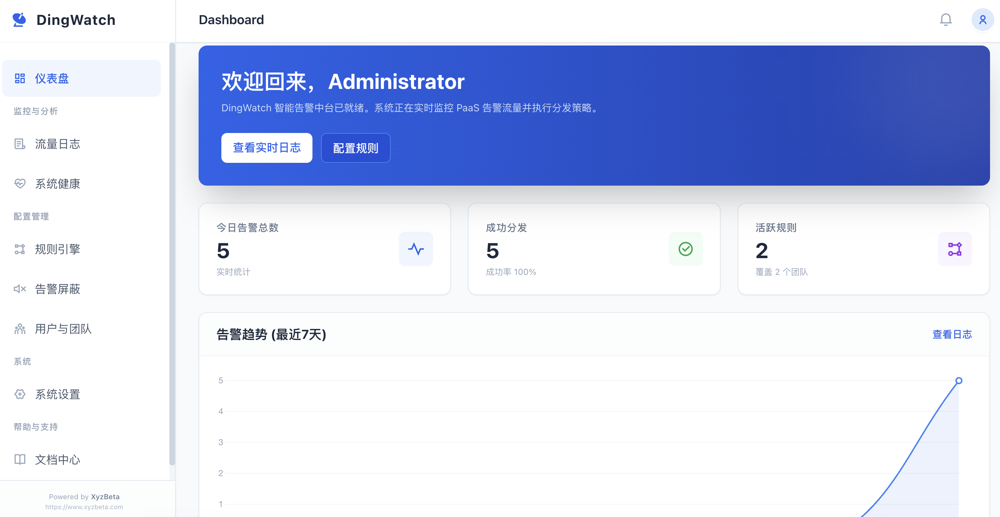
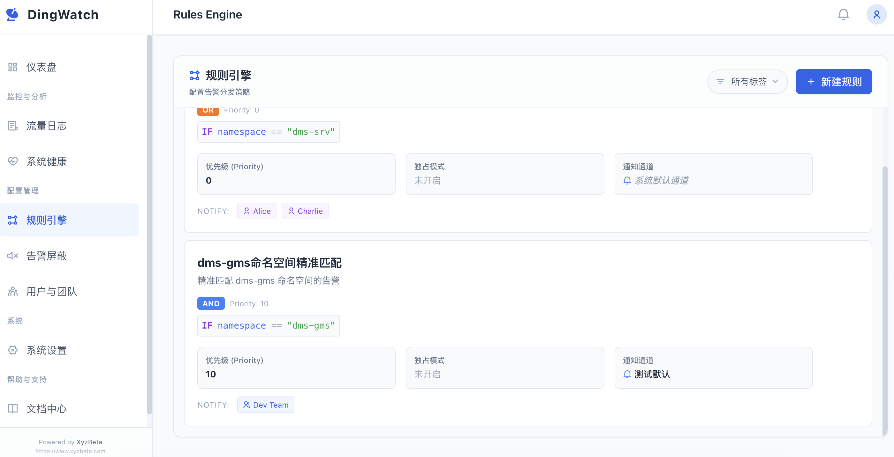
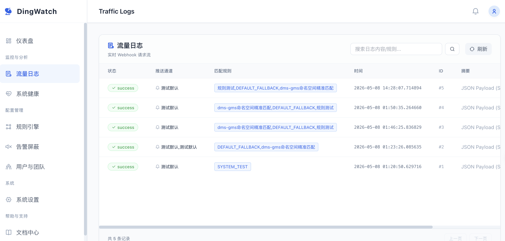
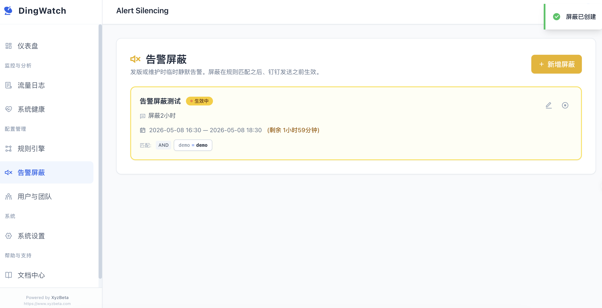
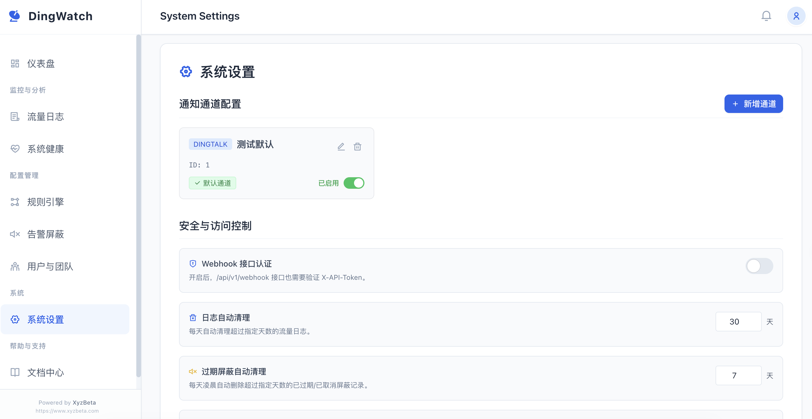
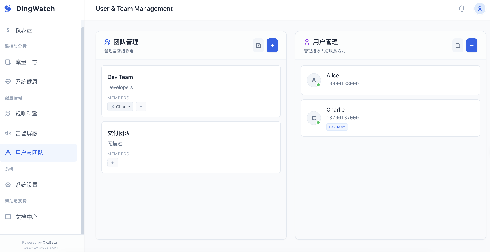
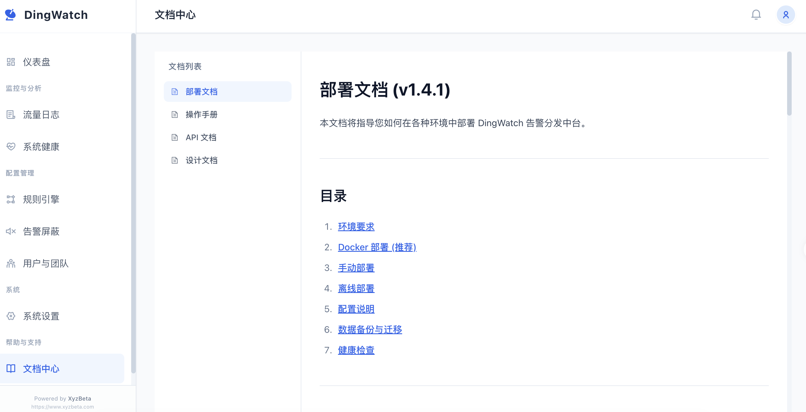
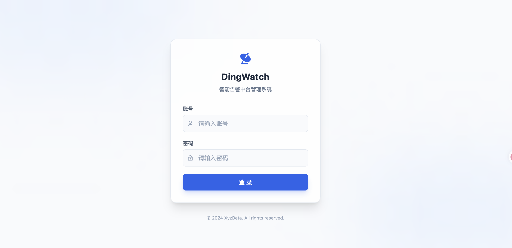

# DingWatch

告警分发中台，统一接收多源监控告警（Prometheus Alertmanager / Grafana / 自定义文本），按规则逐条匹配后精准分发到钉钉群机器人，各自 @ 对应负责人。

## 功能概览

### 仪表盘

实时展示今日告警数量、成功分发率、活跃规则数及 7 日趋势。



### 规则引擎

按优先级配置分发规则，支持 AND / OR 逻辑组合、正则匹配，可绑定通知渠道并指定 @人员或团队。



### 流量日志

完整记录每条告警的请求内容、匹配规则、钉钉发送结果，支持一键回放调试。



### 告警屏蔽

按条件创建静默规则，在指定时间窗口内抑制符合条件的告警，避免不必要的打扰。



### 系统设置

管理钉钉机器人渠道（支持多 channel）、API Token、自定义消息模板（Jinja2 语法）。



### 用户与团队

管理员可创建用户及团队，绑定手机号用于钉钉 @ 通知。



### 文档中心

内置 API 文档与用户操作手册。



## 快速开始

### Docker 部署

```bash
# 1. 配置环境变量
cp .env.example .env
# 编辑 .env，设置 ADMIN_PASSWORD 和 DINGWATCH_JWT_SECRET

# 2. 启动
docker-compose up -d
```

访问 `http://localhost:8000`，使用 `.env` 中配置的管理员账号登录。



### Webhook 接入

将监控系统的 Webhook 地址指向：

```
POST http://<your-host>:8000/api/v1/webhook/send
```

Prometheus Alertmanager 配置示例：

```yaml
receivers:
  - name: 'dingwatch'
    webhook_configs:
      - url: 'http://dingwatch:8000/api/v1/webhook/send'
```

## 配置说明

| 环境变量 | 默认值 | 说明 |
|---------|--------|------|
| `ADMIN_USERNAME` | `admin` | 默认管理员账号 |
| `ADMIN_PASSWORD` | — | 默认管理员密码（首次启动创建） |
| `DINGWATCH_JWT_SECRET` | — | JWT 签名密钥（生产环境务必修改） |
| `LOG_LEVEL` | `INFO` | 日志级别 |

## 技术栈

- **后端**：Python 3.11 / FastAPI / SQLAlchemy / SQLite
- **前端**：Jinja2 模板 + Tailwind CSS + Vue.js
- **部署**：Docker / Docker Compose

## 许可证

MIT License
